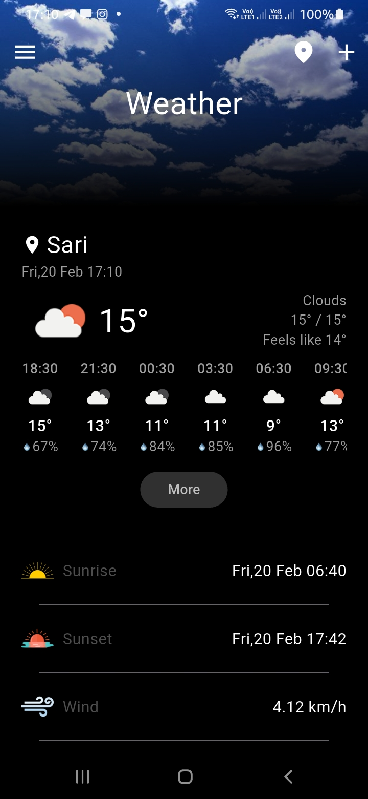
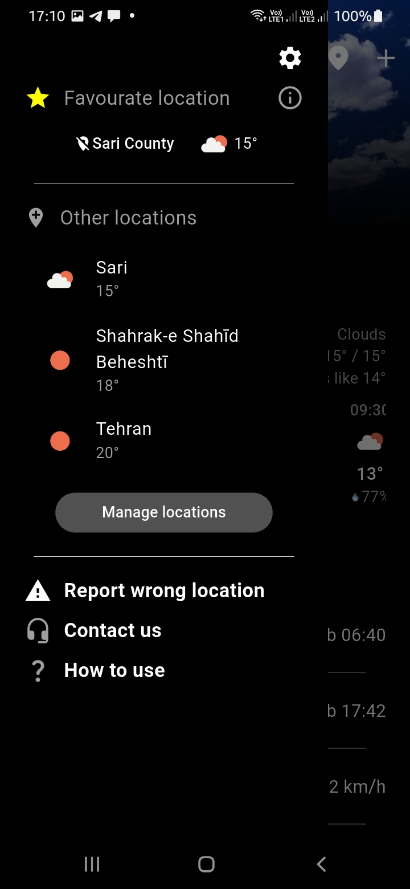
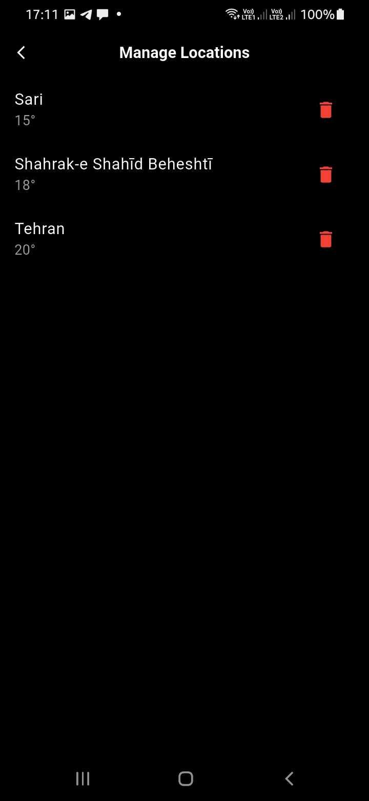
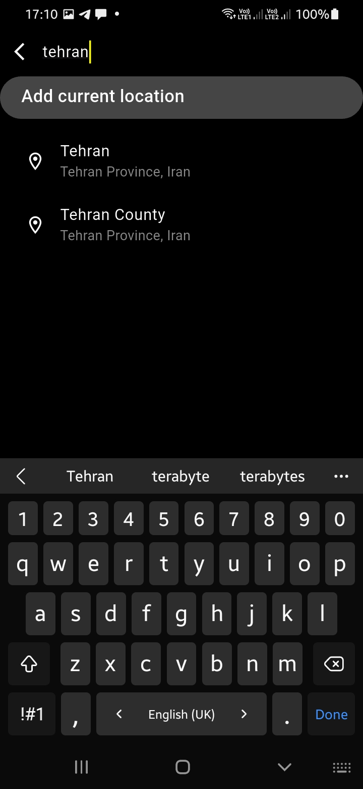
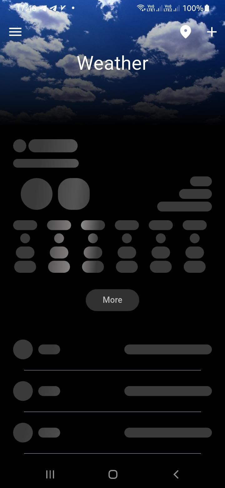

# 🌤 Weather App


## **Description**
This project is a **Flutter-based weather application** that provides **current and forecasted weather** based on the user’s location or a manually entered city.  

- Fetches **live data** when the device is online.  
- Uses **Hive** for **offline caching**, so users can see previously loaded weather even without internet.  
- **Skeletonizer** is used for **smooth loading placeholders**.  
- Users can **save favourite locations** and quickly access them from a **drawer menu**.  
- Handles **location permissions** gracefully and stores user preferences using **SharedPreferences**.

---

## **Features**
- **Current Location Weather**: Requests user permission and displays weather based on GPS coordinates.  
- **City Search**: Users can manually search for any city and get current and forecast weather.  
- **Offline Caching**: Saves data locally using **Hive**, allowing access without internet.  
- **Favourite Locations**: Save current location as favourite for quick access on app launch.  
- **Drawer Navigation**: Switch between saved cities, refresh data, and manage locations.  
- **Skeleton Screens**: Smooth loading placeholders for **current weather** and **hourly forecasts** using **Skeletonizer**.  
- **Real-Time Updates**: Fetches live data via **Dio** from OpenWeatherMap API.  
- **Persistent Storage**: Stores user preferences, selected cities, and location consent using **SharedPreferences**.  
- **Permissions Handling**: Works with **permission_handler** to request location access safely.

---

## **Dependencies**
```yaml
dependencies:
  dio: ^5.9.0
  permission_handler: ^12.0.1
  get_it: ^9.2.0
  flutter_bloc: ^9.1.1
  shared_preferences: ^2.5.4
  flutter_svg: ^2.2.3
  smooth_page_indicator: ^2.0.1
  json_annotation: ^4.9.0
  equatable: ^2.0.7
  bloc: ^9.2.0
  intl: ^0.20.2
  geolocator: ^14.0.2
  path_provider: ^2.1.5
  hive: ^2.2.3
  hive_flutter: ^1.1.0
  skeletonizer: ^2.1.3
```

## **Key Implementation Details**

### **Hive for Offline Storage**
- Caches **current weather** and **forecast data**.  
- Stores **favourite locations** for quick access.  
- Uses `WeatherDataModel` as the main **Hive object**.

### **Bloc State Management**
- Handles **asynchronous fetching** and **caching** seamlessly.  
- `HomeBloc` manages **current weather**, **forecast**, **saved cities**, and **loading states**.

### **Location Handling**
- Requests **user permission** before accessing location.  
- Stores consent in **SharedPreferences** (`agree` or `disagree`).  
- Uses **geolocator** to determine **GPS coordinates** for current location weather.

### **Search and Suggestions**
- Debounced **search input** to reduce API calls.  
- Suggests cities using **API**.  
- Stores selected city and fetches **current weather** and **forecast**.

### **Skeleton Loading**
- Smooth placeholders for **current weather** and **hourly forecasts**.  
- Improves **user experience** during API calls.

---

## **Screenshots**
*Add your screenshots here*

-   
-   
-   
- 
- 
- 


---

## **Hardware / Software Requirements**
- **Device**: Any Android or iOS device/emulator with location services.  
- **Software**: Flutter SDK, Dart 3+, VS Code / Android Studio.  
- **API**: OpenWeatherMap API (or any compatible weather API).  
- **Internet**: Required for live updates; cached data available offline.
